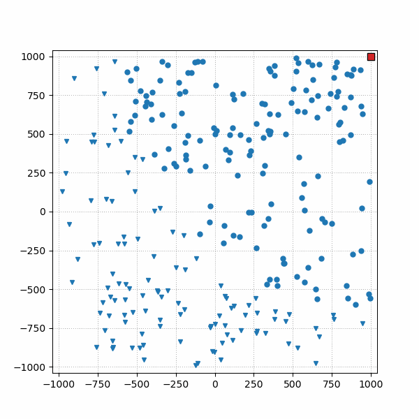
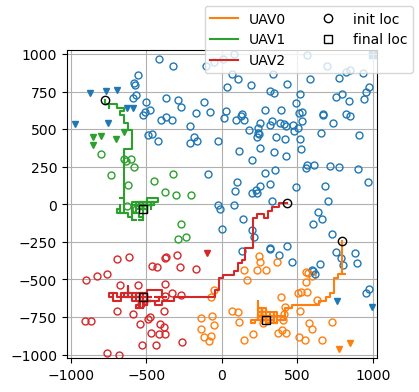
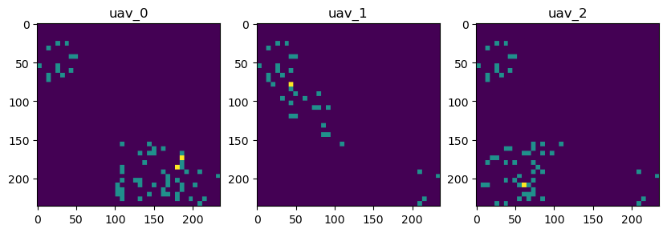

This repository hosts the source code of the paper "[Multi-Agent Reinforcement Learning for Cooperative Trajectory Design of UAV-BS Fleets in Terrestrial/Non-Terrestrial Integrated Networks](https://ieeexplore.ieee.org/document/10554673)," published in _IEICE Communications Express_, vol. 13, no. 8, pp. 327-330, August 2024.

The basic idea is to utilize multi-agent reinforcement learning to optimize the real-time cooperative placement/trajectory of a fleet of UAV-mounted base stations (BSs). These aerial BSs are deployed to support the terrestrial/macro base station in serving some remote users who are experiencing inadequate downlink rates.

<!-- <figure style="text-align: center">
    
    <figcaption>Figure: Trajectory of 3 UAVs (the red, green, and orange squares) which are deployed to complement the macro BS (the blue square placed in the top-right corner).</figcaption>
</figure> -->

<p align="center">
  <br>
  <em style="width: 400px">Figure: Trajectory of 3 UAVs (the red, green, and orange squares) which are deployed to complement the macro BS (the blue square placed in the top-right corner</em>
</p>

In the above simulation, the three UAVs are controlled by a post-trained multi-agent reinforcement learning (MARL) model. During the UAV flight, users are automatically assigned to the terrestrial/aerial BS with the strongest signal, which are presented by their time-varying color. Users with inadequate downlink rates are marked by triangles.

# How it works
Please follow section "Proposed Solution" in the mentioned paper (which is open-access) for detail. The following figures provide a visual explanation that complements the text in the paper.

<!-- <div style="display: flex; justify-content: center;">
  <figure style="margin: 0;">
    
    <figcaption style="text-align: center; max-width: 250px">3 UAVs w/ random initial positions.</figcaption>
  </figure>

  <figure style="margin: 0;">
    
    <figcaption style="text-align: center;">Observations of the 3 UAVs (in the last step) with the proposed MARL approach.</figcaption>
  </figure>
</div> -->

<!-- <p align="center">
  <br>
  <em style="max-width: 400px">Trajectory of 3 UAVs with random initial positions.</em>
</p> -->

<p align="center">
  
  <br>
  <em style="max-width: 650px">Observations of the 3 UAVs (in the last step) with the proposed MARL approach.</em>
</p>

# Repository structure
- [`envs/`](envs): scripts and utilities for setting up the RL environments, following the [Gymnasium](https://gymnasium.farama.org/) (for single-agent RL) and [PettingZoo](https://pettingzoo.farama.org/index.html) (for multi-agent RL) API standard.
- [`figures/`](figures): save figures (e.g.: UAV trajectory, episode return, etc.) created when running other scripts related to MARL models.
- [`runs/`](runs): used for saving TensorBoard logging when training MARL models.
- [`trained_agents/`](trained_agents): save trained MARL models after running `ppo_sagin_v1_1.py`(ppo_sagin_v1_1.py).
- [`sarl/`](sarl): saves everthing that is the output of training single-agent reinforcement learning (SARL) models.
- [`SingleDroneEnv_A2C.ipynb`](SingleDroneEnv_A2C.ipynb) and [`SingleDroneEnv_PPO.ipynb`](SingleDroneEnv_PPO.ipynb): scripts for training SARL models with the single-drone environment.
- [`benchmarking.ipynb`](benchmarking.ipynb): script to evaluate different approaches to solve the multi-UAV placement problem (i.e., multi-agent environment).
- [`kmeans.py`](kmeans.py): script for the first benchmark approach where the K-means clustering algorithm is used to control the movement of UAVs.
- [`kmeans_sb3_sarl`](kmeans_sb3_sarl): script for the second benchmark approach that combines the K-means clustering and a single-agent model to control the movement of UAVs.
- [`ppo_sagin_v1_1.py`](ppo_sagin_v1_1.py) and [`ppo_sagin_v1_1.ipynb`](ppo_sagin_v1_1.ipynb): scripts for the proposed method, utilizing a multi-agent RL approach to optimize the cooperative trajectory of multiple UAVs.


# How to run simulation
0. Create a conda environment and install dependent packages specified in [`environment.yml`](environment.yml)
1. [Optional] Instantiate and train a PPO-based MARL agent with [`ppo_sagin_v1_1.ipynb`](ppo_sagin_v1_1.ipynb). Some trained MARL models are saved in [`trained_agents/stable`](trained_agents/stable) for ease of reproducing the results.
2. [Optional] Instantiate and train a SARL model with [`SingleDroneEnv_PPO.ipynb`](SingleDroneEnv_PPO.ipynb) or [`SingleDroneEnv_A2C.ipynb`](SingleDroneEnv_A2C.ipynb). There are some pre-trained SARL models saved in [`sarl/trained_agents/stable`](sarl/trained_agents/stable).
3. Specify the models in [`benchmarking.ipynb`](benchmarking.ipynb) and run this notebook to evaluate different approaches to solving the multi-UAV placement problem.

# Reference
For citation, please use this BibTex:
```
@ARTICLE{10554673,
  author={Hoang, Linh T. and Nguyen, Chuyen T. and Le, Hoang D. and Pham, Anh T.},
  journal={IEICE Communications Express}, 
  title={Multi-Agent Reinforcement Learning for Cooperative Trajectory Design of UAV-BS Fleets in Terrestrial/Non-Terrestrial Integrated Networks}, 
  year={2024},
  volume={13},
  number={8},
  pages={327-330},
  keywords={Autonomous aerial vehicles;Trajectory;Base stations;Satellites;Reinforcement learning;Low earth orbit satellites;Signal to noise ratio;unmanned aerial vehicles (UAVs);cooperative trajectory design;multi-agent reinforcement learning (MARL);space-air-ground integrated network (SAGIN)},
  doi={10.23919/comex.2024XBL0084}}

```
